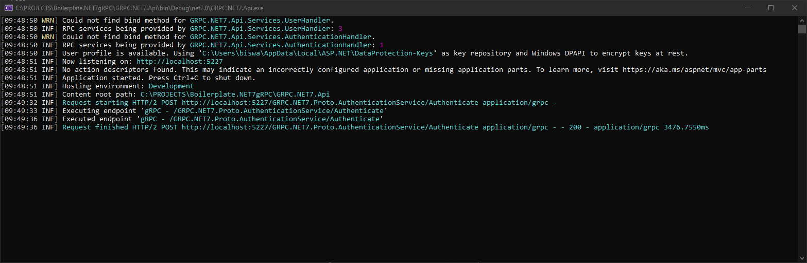

# ProtoCore.NET

## Overview

Effortlessly kickstart your gRPC service development with a modern and robust boilerplate built on .NET 7. This project integrates essential tools and best practices to ensure scalability, maintainability, and ease of use for developers.

This project is a boilerplate for building gRPC-based services using .NET 7. It includes multiple components that work together to create a functional system for client-server communication via gRPC. Below is a breakdown of the key projects and their roles:

### Project Structure

Here is the detailed structure of the solution:

```
Solution 'ProtoCore.NET' (6 of 6 projects)
|
├── GitHub Actions
├── External Sources
├── ClientApp
│   ├── GRPC.NET7.Client
│   │   ├── Helpers
│   │   │   ├── AuthHeaderInterceptor.cs
│   │   │   ├── TracerInterceptor.cs
│   │   ├── Interfaces
│   │   │   ├── AppTokenProvider.cs
│   │   │   ├── AuthService.cs
│   │   │   ├── Extension.cs
│   │   ├── Program.cs
├── Shared
│   ├── GRPC.NET7.Proto
│   │   ├── Helpers
│   │   │   ├── Utility.cs
│   │   ├── Authentication.cs
│   │   ├── BaseResponse.cs
│   │   ├── User.cs
├── GRPC.NET7.Api
│   ├── Properties
│   │   ├── launchSettings.json
│   ├── Converters
│   │   ├── TrimStringConverter.cs
│   ├── Helpers
│   │   ├── AppSettings.cs
│   │   ├── CustomException.cs
│   │   ├── CustomMapper.cs
│   │   ├── ExceptionHelpers.cs
│   │   ├── Extension.cs
│   │   ├── JwtAuthenticationManager.cs
│   │   ├── TimeStampContractResolver.cs
│   ├── Middleware
│   │   ├── Interceptors
│   │   │   ├── ExceptionInterceptor.cs
│   │   │   ├── LoggerInterceptor.cs
│   ├── Services
│   │   ├── AuthenticationHandler.cs
│   │   ├── UserHandler.cs
│   │   ├── appsettings.Development.json
│   │   ├── appsettings.json
│   │   ├── GlobalUsings.cs
│   │   ├── Program.cs
├── GRPC.NET7.Core
│   ├── AutoMapper
│   │   ├── AutoMapperProfile.cs
│   ├── Constants
│   ├── Dtos
│   │   ├── BaseResponseDto.cs
│   ├── Entities
│   │   ├── BaseEntity.cs
│   │   ├── UserEntity.cs
│   ├── Enums
│   │   ├── AppEnums.cs
│   ├── Interfaces
│   │   ├── Common
│   │   │   ├── IMapFrom.cs
│   │   ├── Repositories
│   │   │   ├── IBaseRepository.cs
│   │   │   ├── IUserRepository.cs
│   │   ├── Services
│   │   │   ├── IGreeterService.cs
│   │   │   ├── IUserService.cs
├── GRPC.NET7.Repository
│   ├── Dependencies
│   │   ├── Base
│   │   │   ├── BaseRepository.cs
│   ├── DatabaseContext
│   │   ├── AppDbContext.cs
│   ├── Migrations
│   │   ├── 20221204002240_initial.cs
│   │   ├── AppDbContextModelSnapshot.cs
│   ├── UserRepository.cs
├── GRPC.NET7.Service
│   ├── Dependencies
│   │   ├── Base
│   │   │   ├── GreeterService.cs
│   │   │   ├── UserService.cs
```

---

## Features at a Glance

### 1. gRPC with JSON Transcoding

- Enables dual support for gRPC and RESTful APIs, allowing flexible communication with clients.

### 2. Entity Framework Core 7

- Simplifies database interactions using the latest features of EF Core 7.0.0.

### 3. Swagger Integration

- Auto-generated interactive API documentation for seamless exploration and testing of endpoints.

### 4. Serilog

- Advanced structured logging for superior debugging and monitoring capabilities.

### 5. AutoMapper

- Minimizes boilerplate code with automated object-to-object mapping.

### 6. Custom Proto-Entity-DTO Mappers

- Ensures smooth and type-safe transformations between Protocol Buffers, database entities, and Data Transfer Objects.

### 7. Generics for Reusability

- Leverages generic programming to promote efficiency and maintainability.

---

## Clean Architecture Design

This project adopts clean architecture principles, ensuring:

- **Application Layer**: Encapsulates core business logic and service contracts.
- **Infrastructure Layer**: Manages data access, repositories, and integrations.
- **gRPC Layer**: Serves as the entry point for gRPC endpoints and related logic.

---

## Prerequisites

Before running the application, ensure the following prerequisites are met:

1. **Development Environment**:

   - Visual Studio 2022 or later.
   - .NET 7 SDK installed.

2. **Database**:

   - Set up the database connection string in the `appsettings.json` file under the `GRPC.NET7.Api` project.

---

## How to Run

Follow these steps to set up and run the application:

1. **Clone the Repository**:

   ```
   git clone https://github.com/biswajitpanday/Boilerplate.NET7gRPC.git
   ```

2. **Open the Solution**:

   - Open the solution file (`ProtoCore.NET.sln`) in Visual Studio.

3. **Configure Database**:

   - Navigate to `GRPC.NET7.Api/appsettings.json`.
   - Update the `ConnectionStrings` section with your database connection string.

4. **Set Startup Projects**:

   - Right-click the solution and select `Properties`.
   - Under `Startup Project`, choose `Multiple Startup Projects`.
   - Set `GRPC.NET7.Api` and `GRPC.NET7.Client` actions to `Start`.
   - Click `Apply`, then `Save`.

5. **Run the Application**:

   - Click the `Start` button in Visual Studio.
   - Two command prompts will open:
     - One for the server (`GRPC.NET7.Api`), indicating the server is running:
       
     - Another for the client (`GRPC.NET7.Client`), providing interactive options to test the services:
       

---

## Testing the Application

### Client Options

After the client starts, a menu with five options will be displayed.

Choose an option to interact with the gRPC services. For example, you can authenticate or create a user using the predefined options.


### Server Logs

The server console will display detailed logs of incoming requests and their processing.

Use these logs for debugging or to verify service functionality.


### Client Logs

The client console shows the responses received from the server.


---

## Contribution Guidelines

Contributions are highly encouraged! Follow these steps to get involved:

1. Fork this repository.
2. Create a new feature branch (`git checkout -b feature/your-feature-name`).
3. Commit your changes with clear messages (`git commit -m "Add: Feature description"`).
4. Push the branch and create a pull request.

---

## Support and Contact

Have questions or need support? Reach out via:

- [GitHub Issues](https://github.com/biswajitpanday/Boilerplate.NET7gRPC/issues)
- Email: [biswajitmailid@gmail.com](biswajitmailid@gmail.com)

---

## Planned Improvements

- Convert the `GRPC.NET7.Proto` project into a standalone NuGet package for reuse in multiple services.
- Add Swagger integration for API documentation (currently not functional).

---

## Repository

The source code for this project is available on GitHub:
[Boilerplate.NET7gRPC](https://github.com/biswajitpanday/Boilerplate.NET7gRPC)

---

## License

This project is licensed under the MIT License. See the LICENSE file for more details.

